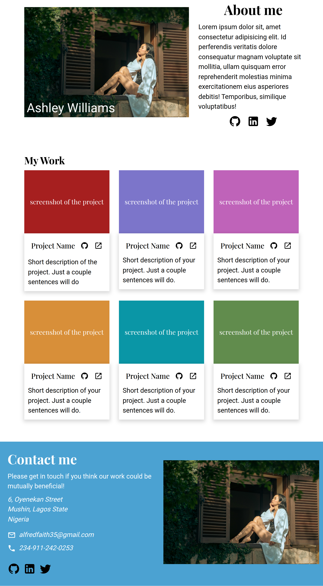

# Responsive Portfolio Homepage

## Project Overview

This project is a responsive homepage design, which serves as a practice for more advanced HTML and CSS concepts. The goal was to create a layout that looks great on all screen sizes - desktop, tablet, and mobile - similar to what you might find on a portfolio site.

## Table of Contents

- [Responsive Portfolio Homepage](#responsive-portfolio-homepage)
  - [Project Overview](#project-overview)
  - [Table of Contents](#table-of-contents)
  - [Description](#description)
  - [Features](#features)
  - [Technologies Used](#technologies-used)
  - [Setup](#setup)
    - [Build View](#build-view)
  - [Credits](#credits)
    - [Design Files](#design-files)
    - [Fonts, Images and Icons](#fonts-images-and-icons)
  - [License](#license)

## Description

For this project, the task was to build a responsive homepage from a provided design brief. The design includes three different sizes: full desktop, tablet, and mobile. The focus was on achieving the specified layouts and responsive behavior rather than creating a complete portfolio.

Project assigned as part of [The Odin Project](https://www.theodinproject.com/lessons/node-path-advanced-html-and-css-homepage) advanced HTML and CSS course.

## Features

- Responsive design for desktop, tablet, and mobile screens
- Custom fonts and colors
- Placeholder images for profiles and headers
- Social media icons with links
- Contact information with icons

## Technologies Used

- HTML5
- CSS3
- Google Fonts (Playfair Display, Roboto)
- Devicon (for social media icons)
- Material Design Icons (for contact icons)

## Setup

To view or edit the project:

1. Clone the repository:

   ```bash
   git clone https://github.com/your-username/responsive-portfolio-homepage.git

2. Checkout the codebase for the build on my [github repo](https://github.com/TonyFred-code/project-homepage)

3. You can also view the final build online hosted on my [github page](https://tonyfred-code.github.io/project-homepage/)

### Build View

Here is a view of the desktop final view

.

## Credits

### Design Files

Design inspiration and brief provided by the course instructor. The design files were provided in three different sizes:

- [Desktop Design](./images/design_images/portfolio.png)
- [Tablet Design](./images/design_images/portfolio%20tablet.png)
- [Mobile Design](./images/design_images/portfolio%20mobile.png)

### Fonts, Images and Icons

- Fonts: Playfair Display and Roboto from [Google Fonts](https://fonts.google.com/)
- Social Media Icons: [Devicon](https://devicon.dev/)
- Contact Icons: [Material Design Icons](https://pictogrammers.com/library/mdi/)
- Portrait images: Pexels by [@dat-tae-studio](https://www.pexels.com/@dat-tae-studio-682298815/)

## License

This project is licensed under the MIT License. See the [LICENSE](./LICENSE) file for details.
